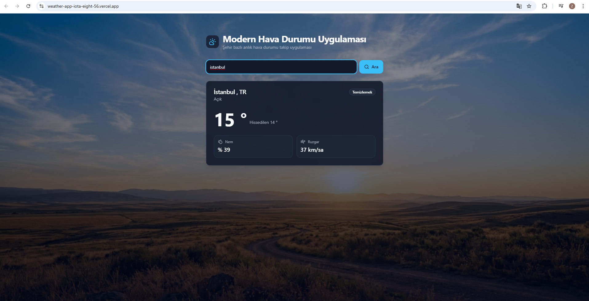

# Modern Weather App

Sehir bazli, anlik hava durumu gosteren modern bir web uygulamasi. OpenWeather API'den canli veri ceker, hava kosullarina gore AI ile uretilmis arka plan gorselleri kullanir.

**Canli demo:** [weather-app-iota-eight-56.vercel.app](https://weather-app-iota-eight-56.vercel.app)



---

## Ozellikler

- **Kullanici authentication** - Email + sifre ile kayit ve giris (Supabase Auth)
- **Korumalı sayfalar** - Giris yapmamis kullanicilar otomatik olarak login sayfasina yonlendirilir
- **Email dogrulama** - Kayit sonrasi gelen email linki ile hesap aktive edilir
- **Sehir aramasi** - Dunyanin herhangi bir sehri icin anlik hava durumu
- **Detayli veri** - Sicaklik, hissedilen, nem, ruzgar hizi
- **Dinamik arka planlar** - Hava durumuna gore AI ile uretilmis 6 farkli gorsel (gunesli, bulutlu, yagmurlu, karli, firtinali, sisli)
- **Responsive** - Mobil, tablet ve masaustunde sorunsuz calisir
- **Hizli** - Vite ile build, Vercel CDN uzerinde dagitiliyor
- **Hata yonetimi** - Gecersiz sehir, ag hatasi gibi durumlar icin kullanici dostu mesajlar
- **Erisilebilir** - prefers-reduced-motion destegi, semantic HTML, ARIA etiketleri

---

## Teknoloji Yigini

| Katman | Teknoloji |
|---|---|
| Frontend | [React 18](https://react.dev) + [TypeScript](https://www.typescriptlang.org) |
| Build Tool | [Vite 5](https://vitejs.dev) |
| Stil | [Tailwind CSS 3](https://tailwindcss.com) |
| UI Bilesenleri | [shadcn/ui](https://ui.shadcn.com) (Button, Input, Card, Badge) |
| Routing | [React Router 6](https://reactrouter.com) |
| Authentication | [Supabase Auth](https://supabase.com/auth) |
| Ikonlar | [lucide-react](https://lucide.dev) |
| API | [OpenWeather](https://openweathermap.org/api) |
| Gorsel Uretimi | AI ile uretilmis arka plan gorselleri |
| Deploy | [Vercel](https://vercel.com) |
| Versiyon Kontrol | Git + GitHub |

---

## Klasor Yapisi

```
weather/
  public/
    backgrounds/             # AI ile uretilmis hava durumu gorselleri
      clear.jpg
      clouds.jpg
      rain.jpg
      snow.jpg
      thunder.jpg
      mist.jpg
    screenshot.png
  src/
    components/
      ui/                    # shadcn/ui bilesenleri
        button.tsx
        input.tsx
        card.tsx
        badge.tsx
      background-shell.tsx   # Arka plan + overlay
      protected-route.tsx    # Auth kontrolu + yonlendirme
      search-form.tsx        # Sehir arama
      status-state.tsx       # Loading / error / idle durumlari
      user-menu.tsx          # Kullanici email + cikis butonu
      weather-card.tsx       # Hava durumu karti
      weather-details.tsx    # Detay metrikleri
    contexts/
      auth-context.tsx       # Auth state'i tum uygulamada paylasir
    pages/
      home.tsx               # Korumali ana sayfa (hava durumu)
      login.tsx              # Giris sayfasi
      signup.tsx             # Kayit sayfasi
    lib/
      api.ts                 # OpenWeather API cagrilari
      supabase.ts            # Supabase client yapilandirmasi
      weather.ts             # Tip tanimlari + yardimci fonksiyonlar
      utils.ts               # cn() yardimci fonksiyonu
    App.tsx                  # Routing yapilandirmasi
    main.tsx                 # Giris noktasi (Router + AuthProvider)
    index.css                # Tailwind direktifleri + tema degiskenleri
  .env.example
  tailwind.config.ts
  vite.config.ts
  package.json
```

---

## Lokal Kurulum

### Gereksinimler

- [Node.js](https://nodejs.org) 18+
- [npm](https://www.npmjs.com) (Node ile birlikte gelir)
- [OpenWeather API key](https://openweathermap.org/api) (ucretsiz)

### Adimlar

```bash
# 1. Repo'yu klonla
git clone https://github.com/znpdilek/weather-app.git
cd weather-app

# 2. Bagimliliklari kur
npm install

# 3. Ortam degiskenlerini ayarla
cp .env.example .env
# .env dosyasini ac ve VITE_OPENWEATHER_API_KEY degerini gir

# 4. Gelistirme sunucusunu baslat
npm run dev
```

Tarayicida `http://localhost:5173` adresini ac.

### Diger komutlar

| Komut | Aciklama |
|---|---|
| `npm run dev` | Gelistirme sunucusunu baslatir (HMR ile) |
| `npm run build` | Production icin optimize edilmis build olusturur |
| `npm run preview` | Production build'i lokalde onizler |

---

## Mimari Kararlar

### 1. Veri katmani ayrimi (`src/lib/`)

API cagrilari, tip tanimlari ve veri normalizasyonu UI'dan ayri bir katmana tasindi. `src/components/` sadece gorsel sunumdan sorumlu.

```
src/lib/api.ts              -> OpenWeather'a HTTP istekleri
src/lib/weather.ts          -> Tip tanimlari + normalizeWeatherData
src/components/*            -> Sadece UI
```

### 2. Veri normalizasyonu

`OpenWeatherResponse` (API'den gelen ham JSON) -> `WeatherData` (UI icin temizlenmis sekil) donusumu tek bir yerde (`normalizeWeatherData`) yapiliyor. UI bilesenleri API'nin degisiminden etkilenmez.

### 3. Hava durumu -> gorsel eslemesi

`getWeatherImage(condition)` fonksiyonu OpenWeather'in `weather.main` alanini uygun arka plan gorseline esler. Yeni bir hava durumu eklemek icin sadece bu fonksiyon ve `public/backgrounds/` guncellenir.

### 4. Tema sistemi

Tum renkler `src/index.css` icinde CSS degiskenleri olarak tanimlandi (HSL formatinda). Tek bir degiskeni degistirerek tum uygulamanin temasini degistirebilirsin.

```css
:root {
  --primary: 198 93% 60%;
  --background: 222 47% 8%;
  /* ... */
}
```

### 5. Tip guvenligi

Tum proje TypeScript ile yazildi. API yanitlari, props, state - hepsi tipli. Build asamasinda (`tsc -b`) tip hatalari yakalanir.

---

## Deploy

Proje [Vercel](https://vercel.com) uzerinde otomatik olarak deploy edilir. `main` branch'e her push isleminden sonra Vercel otomatik build baslatir.

### Ortam degiskenleri

Vercel dashboard -> Project Settings -> Environment Variables:

| Anahtar | Deger | Ortamlar |
|---|---|---|
| `VITE_OPENWEATHER_API_KEY` | OpenWeather API key | Production, Preview |
| `VITE_SUPABASE_URL` | Supabase proje URL'i | Production, Preview |
| `VITE_SUPABASE_ANON_KEY` | Supabase anon (publishable) key | Production, Preview |

### Build ayarlari

Vercel otomatik olarak Vite'i algilar:

- **Framework preset:** Vite
- **Build command:** `npm run build`
- **Output directory:** `dist`
- **Install command:** `npm install`

---

## Lisans

Bu proje egitim amacli gelistirilmistir.

---

**Gelistiren:** [@znpdilek](https://github.com/znpdilek)
